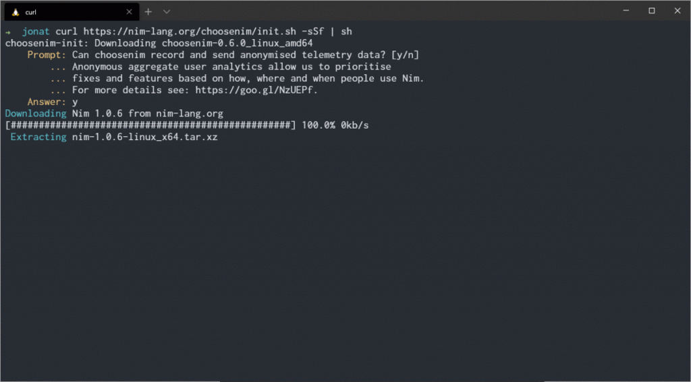
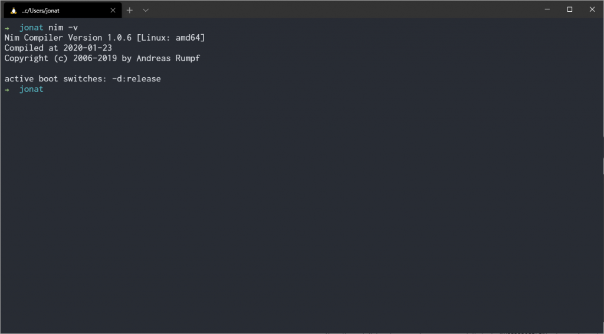

Before we can begin programming in  _Nim_  we must first install the standard libraries and compiler.

This is available online from the  _Nim_ language site as a simple and free download.

[https://nim-lang.org/install_unix.html](https://nim-lang.org/install_unix.html)

_There are several installation methods using choosenim, scoop & manual installation_. In these examples, we will use  _choosenim_.

_Choosenim_  installs  _Nim_ from the official repositories, its created by Dominik Picheta who is a core developer for the  _Nim_  language. It enables fast and easy switching between versions of Nim.

1.  As documented in the official  [GitHub](https://github.com/dom96/choosenim) repository execute the following command from the terminal.

```bash
curl https://nim-lang.org/choosenim/init.sh -sSf | sh
```



4.  Add the folder  `~\.nimble\bin`  to your path as instructed at the end of the installation.
5.  Finally, confirm that  _Nim_  is detected correctly by opening a new terminal window and running

```bash
nim -v
```


