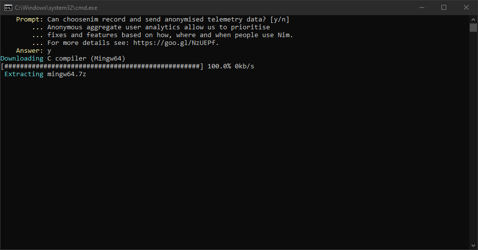
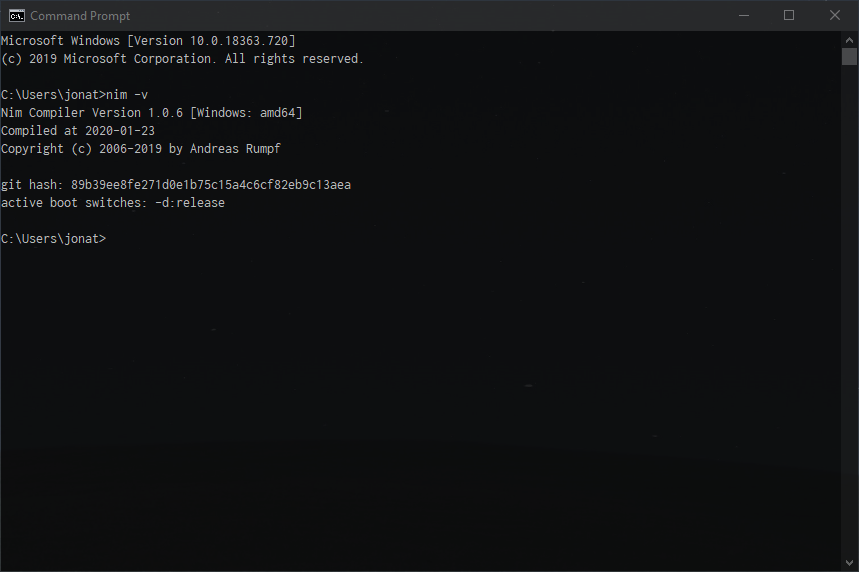

Before we can begin programming in  _Nim_  we must first install the standard libraries and compiler.

This is available online from the  _Nim_ language site as a simple and free download.

[https://nim-lang.org/install_windows.html](https://nim-lang.org/install_windows.html)

Windows users have both 32-bit and 64-bit editions available.

_There are several installation methods using choosenim, scoop & manual installation_. In these examples, we will use  _choosenim_.

_Choosenim_  installs  _Nim_ from the official repositories, its created by Dominik Picheta who is a core developer for the  _Nim_  language. It enables fast and easy switching between versions of Nim.

1.  Navigate to the  _choosenim_  [releases](https://github.com/dom96/choosenim/releases)  page on the official  [GitHub](https://github.com/dom96/choosenim) repository.
2.  Download the latest release in our case, it will be the choosenim-0.6.0_windows_amd64.zip
3.  Once the download is complete unzip the contents and execute the  `runme.bat`



Once the installation has run, choosenim is installed into  `%USERPROFILE%\.choosenim`  and nim is installed in  `%USERPROFILE%\.nimble\bin`

4.  Add the folder  `%USERPROFILE%\.nimble\bin`  to your users’ Path environment variable.
5.  Finally, confirm that  _Nim_  is detected correctly by opening a new cmd window and running

```bash
nim -v
```


